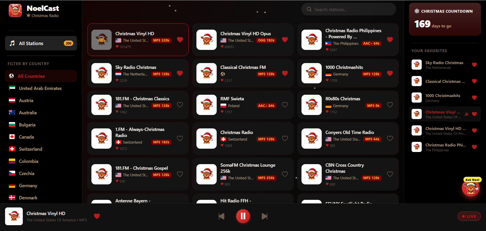
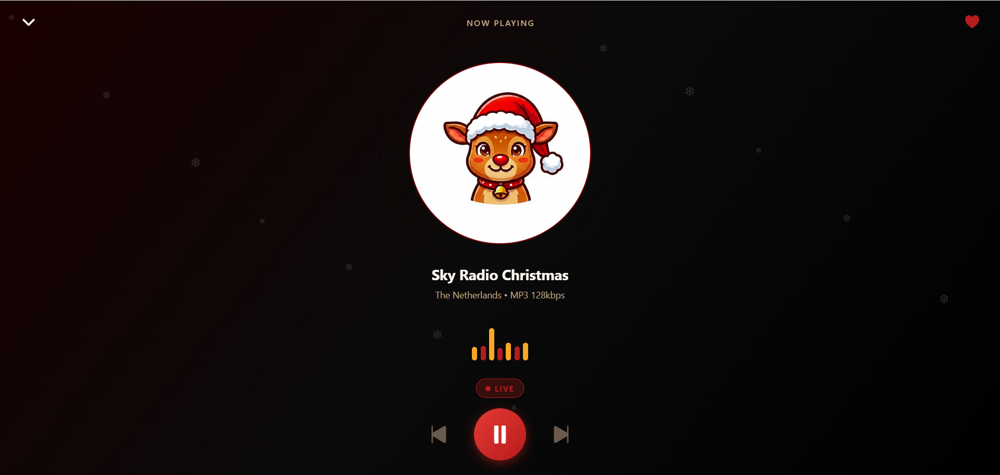
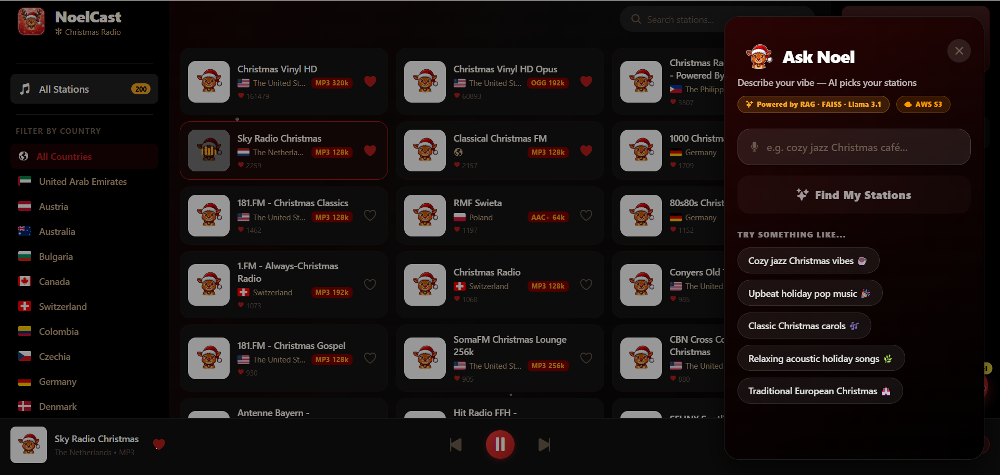
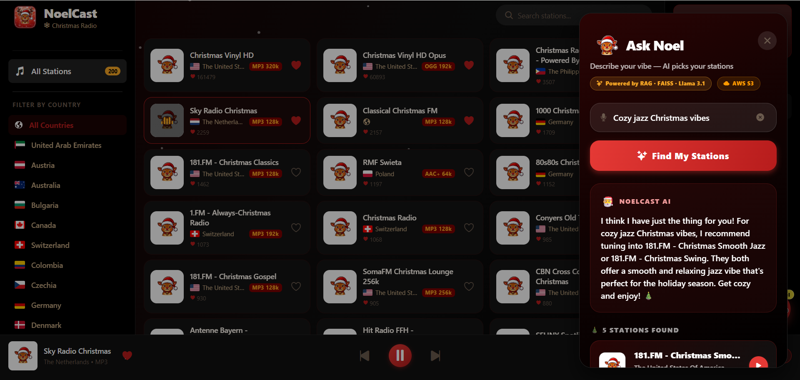
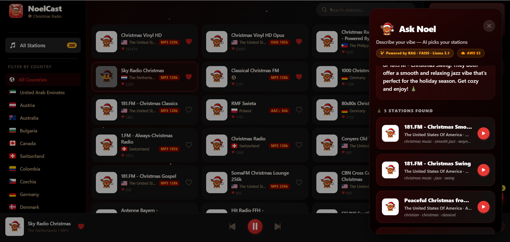
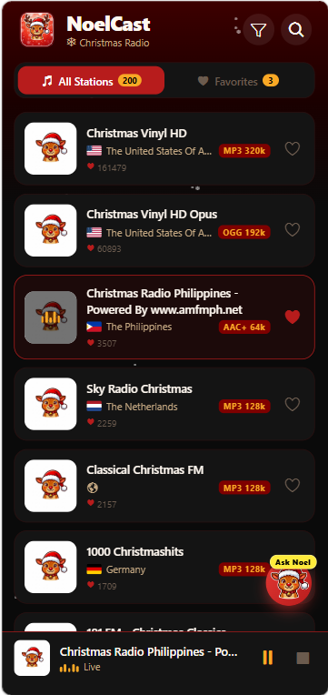
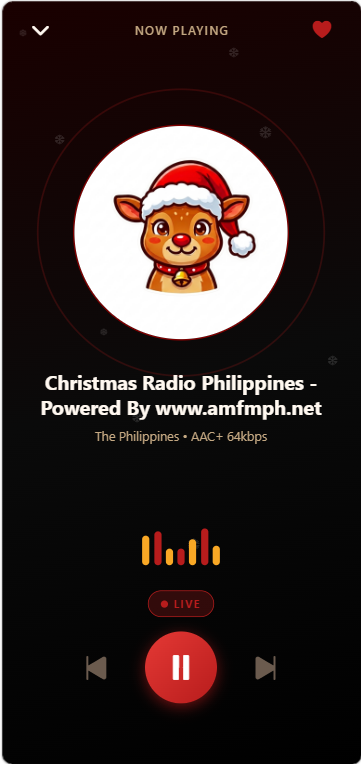
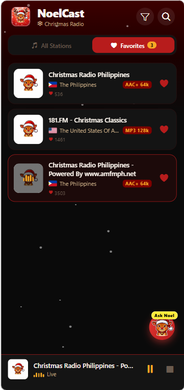
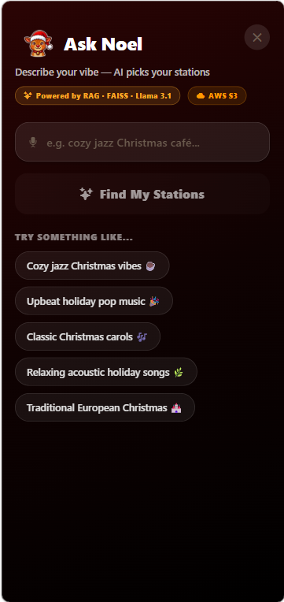
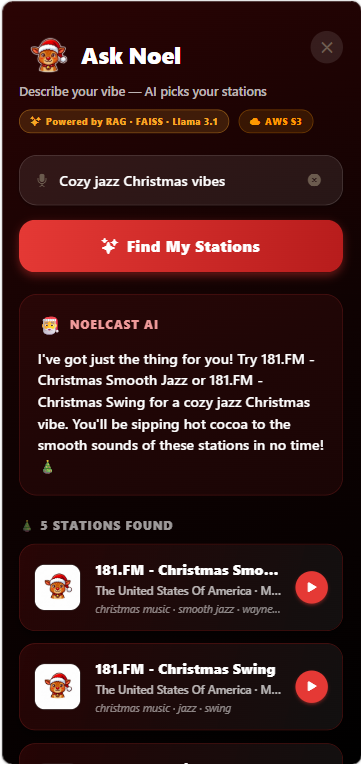

<p align="center">
  
</p>

<h1 align="center">🎄 NoelCast</h1>

<p align="center">
  <strong>A Christmas streaming radio app — listen to holiday music from around the world</strong>
</p>

<p align="center">
  <a href="https://noelcast.netlify.app">
    
  </a>
  <a href="https://github.com/your-username/noel-cast/releases">
    
  </a>
  <a href="LICENSE">
    
  </a>
  
</p>

---

## ✨ Features

- 🎶 **100+ Christmas radio stations** from around the world — sourced from the community-run [Radio Browser API](https://www.radio-browser.info/)
- 🤖 **"Ask NoelCast" AI Recommender** — natural language station discovery powered by a custom RAG pipeline (FAISS + Llama 3.1)
- 🔴 **Live streaming** — play any station instantly with a single tap
- 🎅 **Full-screen player** — Spotify-style player with animated equalizer bars and a pulsing album art ring
- ❄️ **Snow particles** — animated snowflakes throughout the app
- ❤️ **Favorites** — save your favourite stations, persisted locally
- 🔍 **Search** — tap the search icon to find stations by name, country, or genre tag
- 🌍 **Country flags & bitrate info** on every station card
- 📱 **Cross-platform** — runs on **Android** (APK) and **Web** (Netlify) from a single codebase
- 🐍 **Python FastAPI backend** — caches stations, hosts the RAG vector index via AWS S3, and handles LLM generation

---

## 📸 Screenshots

### Web Experience

| Home | Player |
|:---:|:---:|
|  |  |

**Ask NoelCast AI Recommender**

| Chat | Results | Recommendation |
|:---:|:---:|:---:|
|  |  |  |

### Mobile Experience

| Home | Player | Favorites | Ask NoelCast | Ask NoelCast |
|:---:|:---:|:---:|:---:|:---:|
|  |  |  |  |  |


---

## 🏗️ Tech Stack

| Layer | Technology | Deployment |
|---|---|---|
| **Frontend** | [Expo](https://expo.dev) (React Native) | [Netlify](https://netlify.com) (web) · Google Play (Android) |
| **Backend** | [FastAPI](https://fastapi.tiangolo.com/) (Python) | [Render](https://render.com) |
| **AI / RAG** | Groq (Llama 3.1) + FAISS + HuggingFace | Free inference, local embeddings |
| **Storage** | [@react-native-async-storage/async-storage](https://react-native-async-storage.github.io/async-storage/) | localStorage on web |
| **Vector Store** | [AWS S3](https://aws.amazon.com/s3/) (Free Tier) | Persists FAISS index for stateless deployments |
| **Stations API** | [Radio Browser API](https://www.radio-browser.info/) | Free, no key required |

---

## 🚀 Getting Started

### Prerequisites

- [Node.js](https://nodejs.org/) 18+
- [Python](https://www.python.org/) 3.11+

---

### Quick Start (run both FE + BE in one command)

```bash
git clone https://github.com/your-username/noel-cast.git
cd noel-cast

# 1. Install all dependencies (creates Python venv + installs npm packages)
npm run setup

# 2. Start backend + frontend together (Web mode)
npm run dev

# OR: Start backend + frontend together (Mobile Expo Go mode)
npm run dev:mobile
```

That's it. Two terminals open automatically — one for the API, one for Expo — with coloured prefixed output.

| Service | URL |
|---|---|
| Frontend (web) | http://localhost:8081 |
| Backend API | http://localhost:8000 |
| API Docs (Swagger) | http://localhost:8000/docs |

**API Endpoints:**

| Endpoint | Description |
|---|---|
| `GET /health` | Health check |
| `GET /stations` | List Christmas stations — supports `?q=`, `?limit=`, `?offset=` |
| `GET /stations/{uuid}` | Get a single station by UUID |

---

### Manual Setup (optional — if you prefer separate terminals)

**Backend:**

```bash
cd backend

# Create & activate virtual environment
python -m venv ../.venv
../.venv/Scripts/activate        # Windows PowerShell
# source ../.venv/bin/activate   # macOS/Linux

pip install -r requirements.txt

# Copy env file and add your Groq/AWS API keys (required for RAG)
cp .env.example .env

# Build the AI Knowledge Base (fetches stations, builds FAISS index, uploads to S3)
python scripts/build_knowledge_base.py

# Start API server
python -m uvicorn main:app --reload
```

> **Windows PowerShell note:** If `activate` fails with an execution policy error, run once:
> ```powershell
> Set-ExecutionPolicy -ExecutionPolicy RemoteSigned -Scope CurrentUser
> ```

**Frontend:**

```bash
cd frontend
npm install
npm run web
```

---

## 📦 Building for Android (APK & AAB)

> Requires the `android/` folder to be generated first.

1. Generate the Android project and run it locally:
```bash
npm run android
```

2. To build an APK or AAB, bump the version in `package.json` (if needed) and run:

```bash
# APK (sideload / Play Store internal testing)
npm run android:apk

# AAB (Play Store release bundle)
npm run android:bundle
```

The `version:sync` script automatically syncs the version from `package.json` → `app.json` → `android/app/build.gradle` before each build.

Output APK: `frontend/android/app/build/outputs/apk/release/app-release.apk`

---

## ☁️ Deployment

### Web → Netlify

1. Commit your repository to GitHub
2. Import the project as a new Netlify site
3. Set the build command to `npm install && cd frontend && npm run web:build` (or use the toml file configuration)
4. Netlify will use `netlify.toml` to export and deploy `frontend/dist/`

### Backend → Render

1. Create a new **Web Service** on [Render](https://render.com)
2. Connect the `backend/` directory
3. Render auto-detects the `render.yaml` config
4. Update `ALLOWED_ORIGINS` in Render's environment variables to include your Netlify domain

---

## 🗂️ Project Structure

```
noel-cast/
├── backend/                    # Python FastAPI backend
│   ├── main.py                 # App entry, routes, CORS, RAG endpoint
│   ├── stations.py             # Radio Browser API client + cache
│   ├── rag.py                  # RAG pipeline (embed, FAISS search, Groq LLM)
│   ├── aws_storage.py          # AWS S3 integration via boto3
│   ├── scripts/
│   │   └── build_knowledge_base.py # One-time script to build vector index
│   ├── requirements.txt
│   ├── Procfile                # Render process file
│   ├── render.yaml             # Render deployment config
│   └── .env.example
│
└── frontend/                   # Expo React Native app
    ├── app/
    │   ├── _layout.tsx         # Root layout (providers, splash screen)
    │   └── index.tsx           # Home screen (station list, search, tabs)
    ├── components/
    │   ├── FullScreenPlayer.tsx # Spotify-style full-screen player
    │   ├── MiniPlayer.tsx      # Persistent mini player bar
    │   ├── StationCard.tsx     # Station list card
    │   ├── AskNoelCast.tsx     # AI Chat Recommender modal & FAB
    │   └── SnowParticles.tsx   # Animated ❄ snowflakes
    ├── contexts/
    │   ├── PlayerContext.tsx   # Global audio player state
    │   └── FavoritesContext.tsx # Favorites (AsyncStorage / localStorage)
    ├── hooks/
    │   ├── useStations.ts      # Station fetching + search
    │   └── useAskNoelCast.ts   # Hook for calling /ask endpoint
    ├── constants/
    │   ├── Colors.ts           # Design tokens
    │   ├── types.ts            # TypeScript interfaces
    │   └── api.ts              # API base URL config
    ├── assets/images/
    │   ├── icon.png            # App icon & splash
    │   ├── splash-icon.png     # Splash screen image
    │   └── station-placeholder.png  # Reindeer mascot placeholder
    ├── scripts/
    │   └── sync-version.js     # Syncs version across package.json/app.json/gradle
    ├── app.json                # Expo config
    ├── netlify.toml            # Netlify web deployment config
    └── package.json
```

---

## 🤝 Contributing

Contributions, issues, and feature requests are welcome! Feel free to open a PR or an issue.

1. Fork the repository
2. Create your feature branch: `git checkout -b feature/my-feature`
3. Commit your changes: `git commit -m 'feat: add my feature'`
4. Push to the branch: `git push origin feature/my-feature`
5. Open a Pull Request

---

## 📜 License

This project is open-source and available under the [MIT License](LICENSE).

---

## 🙏 Acknowledgements

- [Radio Browser](https://www.radio-browser.info/) — Free community radio station directory
- [Expo](https://expo.dev) — Amazing cross-platform React Native toolchain
- [FastAPI](https://fastapi.tiangolo.com/) — Lightning-fast Python API framework
- Reindeer mascot art — Generated with Google Gemini

---

<p align="center">Made with ❤️ and 🎄 — Merry Christmas!</p>
